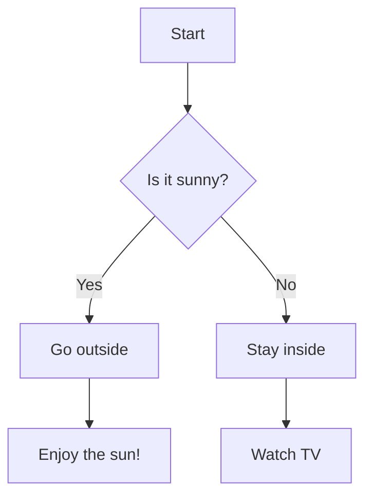

To display a diagram in Markdown using Mermaid, you need to use the Mermaid syntax inside a code block. Here’s how to do it:

1. Surround your Mermaid diagram code with triple backticks (` ``` `).
2. After the opening triple backticks, specify `mermaid` to indicate that the block contains Mermaid syntax.
3. Write your Mermaid diagram code.

Here's an example of a simple flowchart using Mermaid:

````markdown

````

This will render the diagram as a flowchart when viewed in Markdown-supported environments that recognize Mermaid diagrams (such as GitHub, GitLab, or certain Markdown editors with Mermaid integration).

Make sure that the platform or editor you're using supports Mermaid, as not all Markdown parsers do so natively.


To view a Mermaid diagram from your Markdown code, you need to use a platform or tool that supports rendering Mermaid diagrams. Here are several ways to see the diagram:

### 1. **GitHub or GitLab**
- If you're working with Markdown files on GitHub or GitLab, they will automatically render the Mermaid diagram. Simply commit and push your `.md` file, and when you view it online, the Mermaid diagram will appear as intended.

### 2. **VSCode with the Markdown Preview Mermaid Support Extension**
- Install [Visual Studio Code](https://code.visualstudio.com/).
- Then install the extension called "Markdown Preview Mermaid Support."
- Open your Markdown file in VSCode and use `Ctrl + Shift + V` (or `Cmd + Shift + V` on Mac) to preview the Markdown file with the Mermaid diagram rendered.

### 3. **Markdown Preview Enhanced (VSCode or Atom)**
- Install the "Markdown Preview Enhanced" extension in VSCode or Atom.
- This extension has native support for Mermaid diagrams. Use the Markdown preview feature to view the diagram.

### 4. **Online Markdown Editors with Mermaid Support**
- You can use online tools such as:
  - [StackEdit](https://stackedit.io/)
  - [Dillinger](https://dillinger.io/)
  - [Markdown Live Preview](https://markdownlivepreview.com/)
  
These tools support Mermaid syntax and will render the diagrams in the preview mode.

### 5. **Mermaid Live Editor**
- You can paste your Mermaid code into the [Mermaid Live Editor](https://mermaid-js.github.io/mermaid-live-editor/).
- This tool is specifically for testing Mermaid diagrams. You can write and preview your diagrams directly in your browser.

These options should allow you to see the diagram easily!