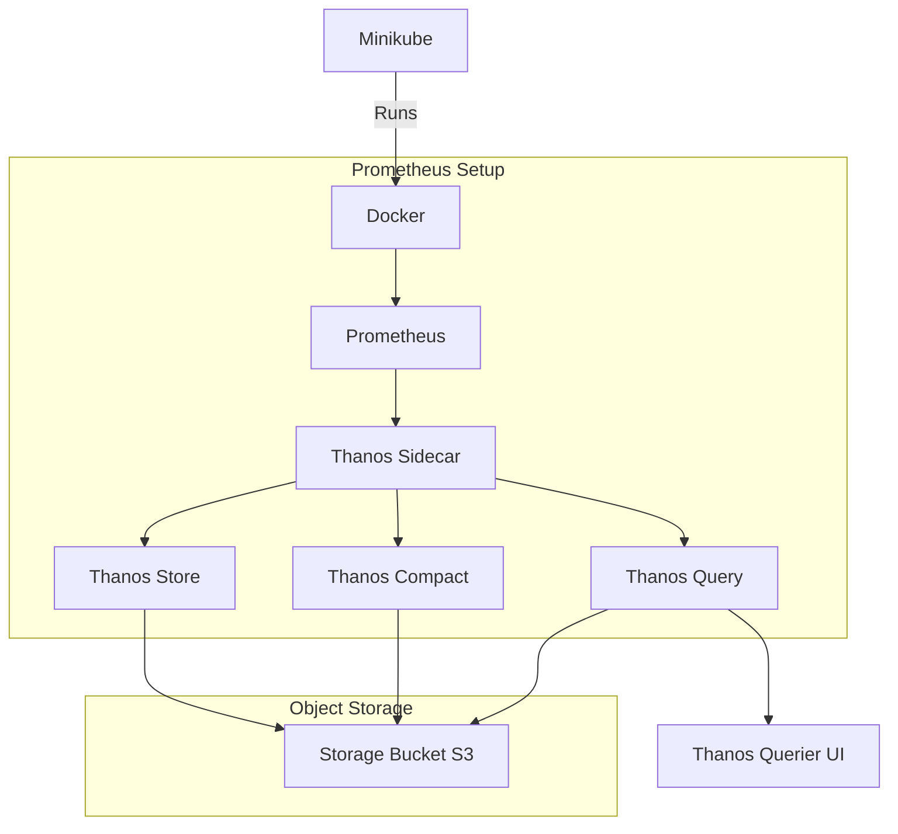

Here’s how you can represent a Minikube setup with Docker, including Thanos components, using Mermaid syntax:

### Explanation:
- **Minikube** runs the **Docker** engine, which manages containers.
- **Prometheus** is running inside Docker and collects metrics.
- **Thanos Sidecar** attaches to Prometheus, allowing data to be shipped and queried across long-term storage.
- **Thanos Store** and **Thanos Compact** handle object storage and data compaction.
- The **Thanos Query** component serves queries across different Prometheus instances, and its output can be visualized using the **Thanos Querier UI**.
- The **Storage Bucket (S3/GCS)** represents an external object storage system used by Thanos for long-term data storage.

Let me know if you would like any adjustments to the chart or details about setting this up in Minikube!